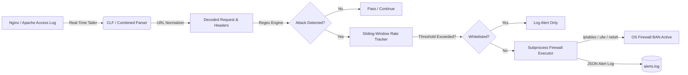

<div align="center">

# 🛡️ LogSentinel

### Autonomous Real-Time Nginx & Apache Log Intrusion Detection & Active Firewall Response Daemon

[](https://github.com/Drizzy-ul/log-sentinel/actions)
[](https://www.python.org/)
[](https://opensource.org/licenses/MIT)
[-brightgreen.svg)](https://docs.python.org/3/library/)
[](#supported-firewall-backends)
[](https://github.com/psf/black)

<p align="center">
  <b>LogSentinel</b> tails live HTTP access logs in real-time, extracts incoming web requests with high-performance regular expressions, detects web application exploit payloads (SQLi, XSS, Path Traversal, RCE, sensitive probing), tracks attacker infraction rates with a sliding time window, and executes OS-level firewall bans automatically via <code>iptables</code>, <code>ufw</code>, <code>nftables</code>, or <code>netsh</code>.
</p>

```
  ██╗      ██████╗  ██████╗ ███████╗███████╗███╗   ██╗████████╗██╗███╗   ██╗███████╗██╗     
  ██║     ██╔═══██╗██╔════╝ ██╔════╝██╔════╝████╗  ██║╚══██╔══╝██║████╗  ██║██╔════╝██║     
  ██║     ██║   ██║██║  ███╗███████╗█████╗  ██╔██╗ ██║   ██║   ██║██╔██╗ ██║█████╗  ██║     
  ██║     ██║   ██║██║   ██║╚════██║██╔══╝  ██║╚██╗██║   ██║   ██║██║╚██╗██║██╔══╝  ██║     
  ███████╗╚██████╔╝╚██████╔╝███████║███████╗██║ ╚████║   ██║   ██║██║ ╚████║███████╗███████╗
  ╚══════╝ ╚═════╝  ╚═════╝ ╚══════╝╚══════╝╚═╝  ╚═══╝   ╚═╝   ╚═╝╚═╝  ╚═══╝╚══════╝╚══════╝
```

[Key Features](#-key-features) • [Architecture](#-architecture) • [Quick Start](#-quick-start) • [Detection Vectors](#-attack-detection-vectors) • [Deployment](#-production-deployment) • [Docker](#-docker-deployment)

</div>

---

## ⚡ Key Features

- 🔄 **Non-Blocking Real-Time File Tailing**: Streams lines as they are appended using Python generators. Automatically survives `logrotate` rotations (inode changes) and file truncations (`copytruncate`).
- 🔍 **Multi-Pass URL Normalization**: Decodes recursive percent-encoding (`%2527` $\rightarrow$ `%27` $\rightarrow$ `'`) to eliminate URL-encoding evasion techniques.
- 🎯 **Deep Threat Signature Registry**: Pre-compiled regular expressions inspecting URIs, query strings, User-Agent, and Referer headers.
- ⏱️ **Sliding-Window Rate Tracking**: Configurable infraction thresholds over rolling time windows (e.g., 3 attacks within 60s) to prevent false-positive overreactions.
- 🛡️ **Zero-Injection Firewall Execution**: Strict validation using `ipaddress.ip_address` and parameterized `subprocess.run(shell=False)` prevents command injection attacks from malicious client IPs.
- 🌐 **Multi-Platform Firewall Backends**:
  - Linux `iptables` (INPUT table drop)
  - Ubuntu/Debian `ufw` (`ufw deny from <IP>`)
  - Modern Linux `nftables` (`nft add element ...`)
  - Windows Server `netsh advfirewall`
  - Safe `dry-run` simulation mode for unprivileged testing
- 📜 **Structured JSON-Lines Alert Logging**: Appends detailed audit records with matched rules, severity, timestamps, and offending payloads.
- 📦 **Zero External Dependencies**: Engineered entirely with Python standard library modules (`re`, `subprocess`, `ipaddress`, `urllib.parse`, `dataclasses`, `argparse`).

---

## 🏗️ Architecture



---

## 🛡️ Attack Detection Vectors

| Attack Category | Threat Level | Sample Signature Patterns | Target Fields |
|---|:---:|---|---|
| **SQL Injection (SQLi)** | `CRITICAL` / `HIGH` | `UNION SELECT`, `' OR 1=1`, stacked `DROP TABLE`, `SLEEP()`, `WAITFOR DELAY`, `--`, `/*` | URI, Query, User-Agent |
| **Cross-Site Scripting (XSS)** | `HIGH` / `MEDIUM` | `<script>`, `javascript:`, `onerror=`, `onload=`, `document.cookie`, `<iframe>` | URI, Query, Referer |
| **Path Traversal & LFI** | `CRITICAL` / `HIGH` | `../`, `..\`, `/etc/passwd`, `/etc/shadow`, `win.ini`, `proc/self/`, `php://filter` | URI, Query |
| **Remote Code Execution (RCE)** | `CRITICAL` | `;&|` command chaining + binaries (`cat`, `id`, `whoami`, `nc`, `curl`, `wget`, `bash`) | URI, Query, User-Agent |
| **Reconnaissance & Probing** | `HIGH` / `MEDIUM` | `/.env`, `wp-config.php`, `/.git/`, `/phpmyadmin`, `web.config` | URI |

---

## 🚀 Quick Start

### 1. Installation

Clone the repository:
```bash
git clone https://github.com/Drizzy-ul/log-sentinel.git
cd log-sentinel
```

No external `pip install` required! LogSentinel runs natively with Python 3.8+.

Optional editable install:
```bash
pip install -e .
```

---

### 2. Running in Safe Simulation Mode (`dry-run`)

Test on any operating system without requiring administrative or root privileges:

```bash
python main.py --log-file access.log --backend dry-run --threshold 3 --window 60
```

---

### 3. Live Attack Simulation Test

Launch the included mock traffic generator in another terminal to simulate real-world attacks and verify the pipeline:

```bash
python scripts/demo_simulation.py
```

**Terminal Showcase:**
```text
  ██╗      ██████╗  ██████╗ ███████╗███████╗███╗   ██╗████████╗██╗███╗   ██╗███████╗██╗     
  ██║     ██╔═══██╗██╔════╝ ██╔════╝██╔════╝████╗  ██║╚══██╔══╝██║████╗  ██║██╔════╝██║     
  ██║     ██║   ██║██║  ███╗███████╗█████╗  ██╔██╗ ██║   ██║   ██║██╔██╗ ██║█████╗  ██║     
  ██║     ██║   ██║██║   ██║╚════██║██╔══╝  ██║╚██╗██║   ██║   ██║██║╚██╗██║██╔══╝  ██║     
  ███████╗╚██████╔╝╚██████╔╝███████║███████╗██║ ╚████║   ██║   ██║██║ ╚████║███████╗███████╗
  ╚══════╝ ╚═════╝  ╚═════╝ ╚══════╝╚══════╝╚═╝  ╚═══╝   ╚═╝   ╚═╝╚═╝  ╚═══╝╚══════╝╚══════╝
  Real-Time Nginx & Apache Access Log Intrusion Detection & Active Firewall Daemon
======================================================================================
[ALERT - SQLi] Rule: SQLi_Boolean_Bypass | IP: 198.51.100.25 | Severity: HIGH | Payload: '' OR 1=1'
[ALERT - SQLi] Rule: SQLi_Union_Select   | IP: 198.51.100.25 | Severity: CRITICAL | Payload: 'UNION SELECT'
[ALERT - SQLi] Rule: SQLi_Stacked_Or_DDL | IP: 198.51.100.25 | Severity: CRITICAL | Payload: '; DROP TABLE'

╔════════════════════════════════════════════════════════════════════════════════╗
║ [ACTIVE FIREWALL MITIGATION TRIGGERED]                                         ║
║ Offender IP:      198.51.100.25                                                ║
║ Offenses Count:   3 infractions within 60s                                     ║
║ Firewall Backend: iptables                                                     ║
╚════════════════════════════════════════════════════════════════════════════════╝

[SUCCESS] Firewall rule applied for 198.51.100.25: iptables -A INPUT -s 198.51.100.25 -j DROP
```

---

## ⚙️ Command Line Reference

```bash
python main.py [-h] [-f LOG_FILE] [-b {iptables,ufw,nftables,windows-netsh,dry-run}]
               [-t ATTACK_THRESHOLD] [-w TIME_WINDOW] [--no-dry-run]
               [--from-beginning] [--whitelist WHITELIST [WHITELIST ...]]
               [--alert-log ALERT_LOG] [--custom-block-cmd CUSTOM_BLOCK_CMD]
```

| Flag | Long Argument | Default | Description |
|---|---|:---:|---|
| `-f` | `--log-file` | `access.log` | Path to the Nginx or Apache access log file to monitor |
| `-b` | `--backend` | `dry-run` | Firewall engine (`iptables`, `ufw`, `nftables`, `windows-netsh`, `dry-run`) |
| `-t` | `--threshold` | `3` | Number of attack infractions before initiating firewall ban |
| `-w` | `--window` | `60` | Rolling sliding window in seconds for rate counting |
| | `--no-dry-run` | `False` | Execute live OS firewall modifications (requires root/Admin) |
| | `--from-beginning` | `False` | Process log from byte 0 instead of tailing end |
| | `--whitelist` | `127.0.0.1 ::1 ...` | Space-separated IP addresses or CIDR subnets exempt from bans |
| | `--alert-log` | `alerts.log` | Path to JSON-lines structured threat audit log file |
| | `--custom-block-cmd` | `None` | Custom command template (e.g. `"csf -d {ip}"`) |

---

## 🐧 Production Deployment

### 1. Linux with `iptables`
```bash
sudo python3 main.py \
  --log-file /var/log/nginx/access.log \
  --backend iptables \
  --threshold 3 \
  --window 60 \
  --no-dry-run
```

### 2. Linux with `ufw`
```bash
sudo python3 main.py \
  --log-file /var/log/nginx/access.log \
  --backend ufw \
  --threshold 3 \
  --window 60 \
  --no-dry-run
```

### 3. Running as a `systemd` Background Service
Copy the included service template:
```bash
sudo cp deployment/systemd/logsentinel.service /etc/systemd/system/
sudo systemctl daemon-reload
sudo systemctl enable --now logsentinel
sudo systemctl status logsentinel
```

### 4. Windows Server with `netsh`
Open an elevated Administrator PowerShell prompt:
```powershell
python main.py -f "C:\nginx\logs\access.log" -b windows-netsh --no-dry-run
```

---

## 🐳 Docker Deployment

Run LogSentinel containerized while managing the host's firewall rules:

```bash
docker-compose up -d
```

---

## 🧪 Running Unit Tests

LogSentinel includes a complete automated test suite covering regex patterns, URL normalization, rotation/truncation tailing, sliding-window algorithms, and command injection immunity:

```bash
python -m unittest discover tests -v
```

---

## 🔒 Security Principles

1. **Immunity to Command Injection**: Every IP address is parsed with `ipaddress.ip_address` into a binary object before stringification. Subprocess calls strictly use list arguments with `shell=False`.
2. **Whitelist Protection**: Internal loopback (`127.0.0.1`, `::1`) and RFC 1918 private subnets (`10.0.0.0/8`, `172.16.0.0/12`, `192.168.0.0/16`) are whitelisted by default to avoid self-lockouts.
3. **Fail-Safe Defaults**: Dry-run mode is enabled by default unless `--no-dry-run` is explicitly provided.

---

## 👤 Author

**Kelvin Amartey Winston**
- GitHub: [@Drizzy-ul](https://github.com/Drizzy-ul)
- LinkedIn: [Kelvin Amartey Winston](https://www.linkedin.com/in/kelvin-amartey-winston-2935b8386/)
- Email: kelvinamarteywinston@gmail.com

---

## 📄 License

This project is licensed under the MIT License - see the [LICENSE](LICENSE) file for details.
